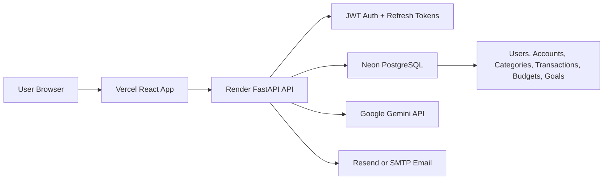
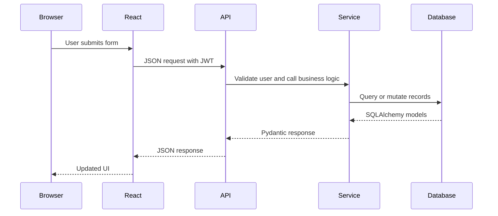

# Architecture

MoneyMate is a React + FastAPI personal finance application. The frontend talks to the API over JSON, and the API persists user data in PostgreSQL.

## Frontend

The frontend lives in `client/` and uses:
- React
- Vite
- React Router
- CSS Modules
- Recharts

Important areas:
- `client/src/routes/AppRoutes.tsx`: route definitions and route-level lazy loading.
- `client/src/layouts/AppShell.tsx`: protected app shell, navigation, search, theme toggle, and chat launcher.
- `client/src/services/`: API client wrappers.
- `client/src/pages/`: page-level views.
- `client/src/components/`: reusable UI components.

## Backend

The backend lives in `app/` and uses:
- FastAPI routers in `app/routers/`
- SQLAlchemy models in `app/models/`
- Service-layer business logic in `app/services/`
- Alembic migrations in `alembic/versions/`

Request flow:

## Data Model Summary

Core tables:
- `users`: account identity, password hash, token metadata.
- `refresh_tokens`: refresh-session storage.
- `financial_profiles`: onboarding and user finance settings.
- `monthly_income_history`: month-by-month income snapshots.
- `accounts`: user accounts such as Cash or Savings.
- `categories`: user category catalog.
- `transactions`: income and expense records.
- `budgets`: category budgets by month and year.
- `goals` and `goal_contributions`: savings goals and logged progress.
- `chat_conversations` and `chat_messages`: AI chat history.

## Performance Notes

Route-level lazy loading keeps the first frontend bundle smaller. Database indexes cover common filters and joins for:
- account/date transaction lists
- category/date transaction analytics
- user/month/year budget views
- user/category lookups
- user/active goal lists

## Security Notes

- Passwords are hashed server-side.
- JWT access tokens are used for authenticated API calls.
- Refresh tokens are stored server-side and rotated.
- Secrets stay in backend environment variables.
- Frontend `VITE_` variables are public by design.
